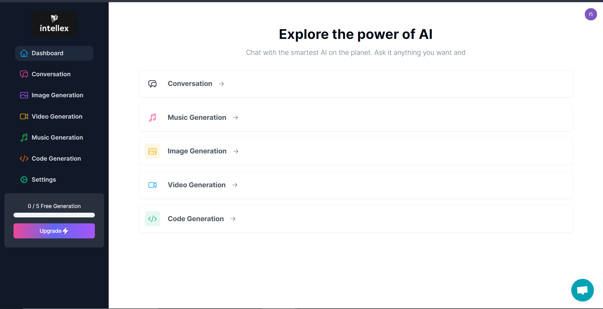
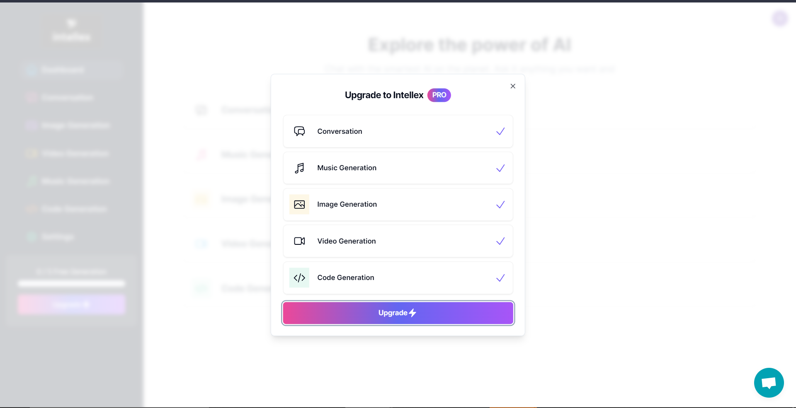
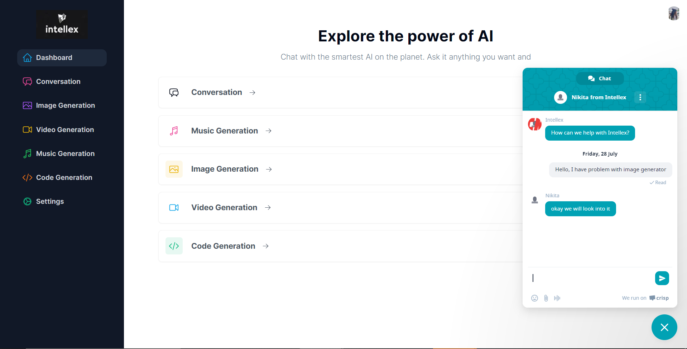
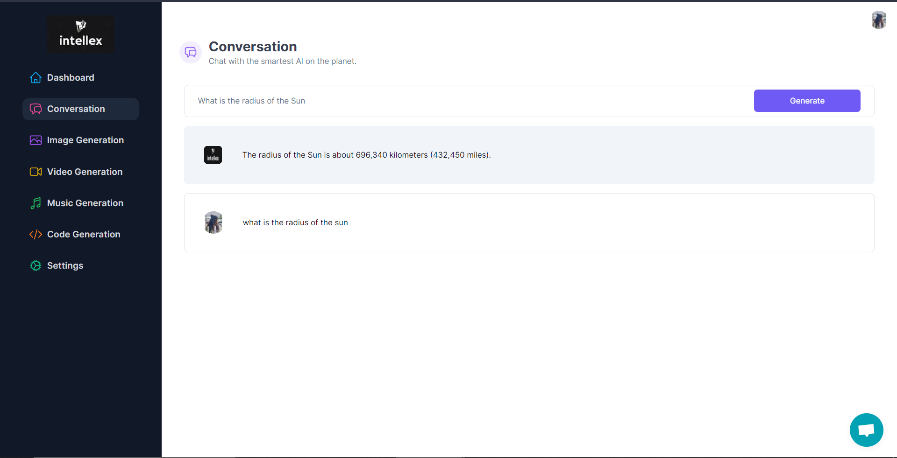
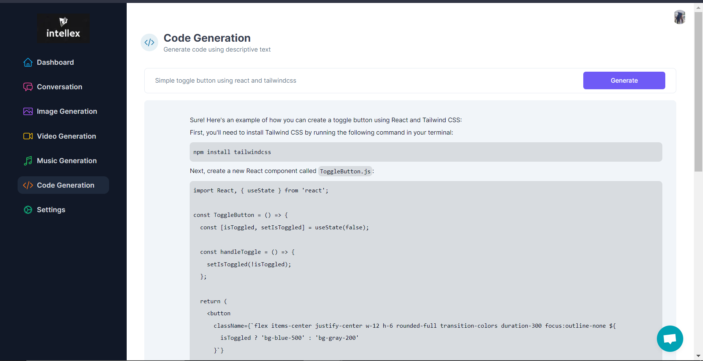
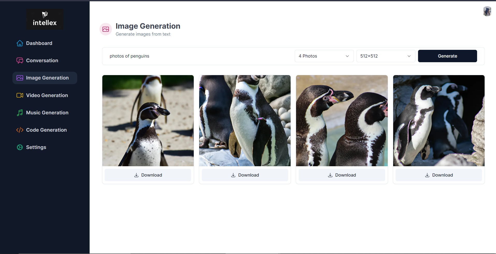
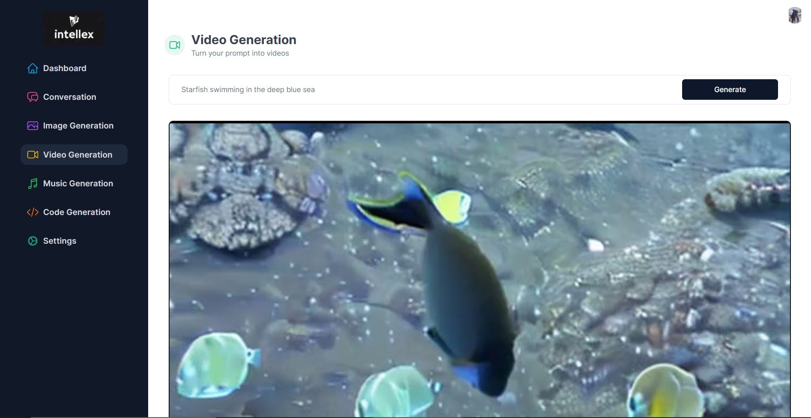
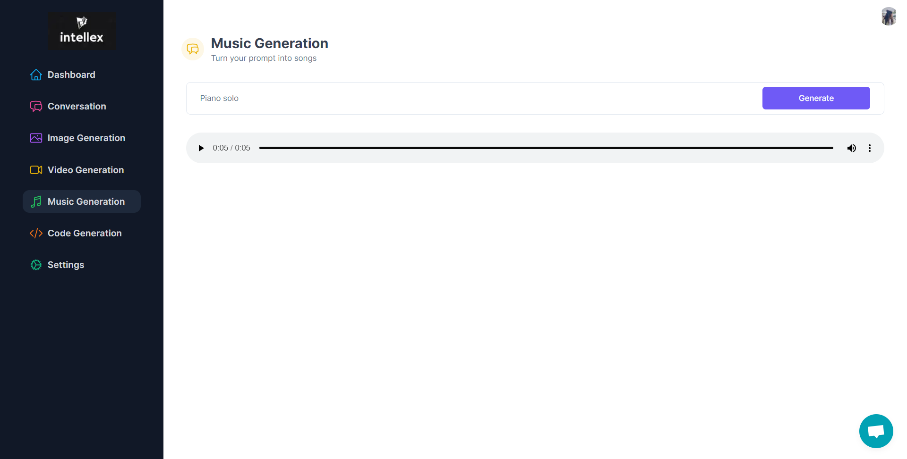
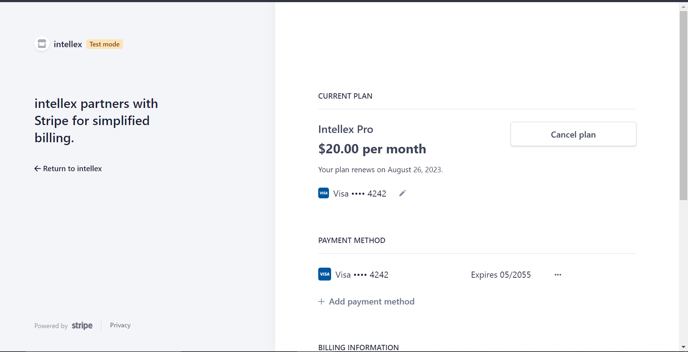
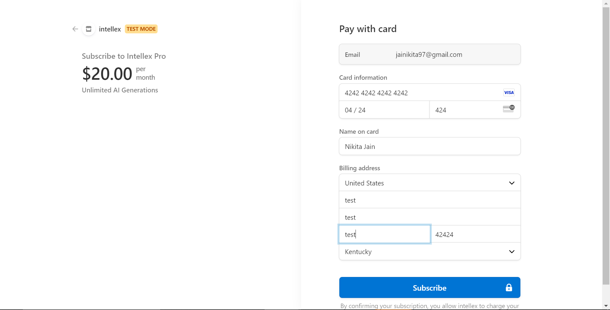

<!-- dashboard views -->

Dashboard

<!-- conversation -->

Conversation

<!-- Code  -->

Code Generation

<!-- image -->

Image Generation

<!-- video -->

Video Generation

<!-- music -->

Music Generation

<!-- stripe -->

Stripe

